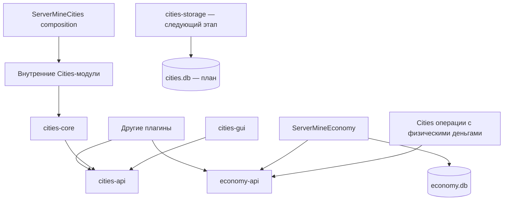

# Архитектура

ServerMine состоит из независимых доменов. На сервер устанавливаются два плагина: Economy и Cities.
Публичные API не зависят от Bukkit, SQLite или реализаций плагинов.

Economy публикует EconomyService через Bukkit ServicesManager. Cities зависит в `plugin.yml` от ServerMineEconomy и получает тот же экземпляр Economy API через загрузчик плагина.
Economy API включён только в Economy JAR. Cities API и все внутренние Cities-классы включены в Cities JAR.

Cities сейчас публикует UnconfiguredCitiesService с readiness=false. Это явное состояние bootstrap: данных города и рабочих мутаций пока нет.
Не следует менять readiness на true до реализации хранилища и гарантий транзакций.

SQL Economy выполняется на выделенном однопоточном executor. Bukkit-инвентари меняются через MainThread.
Инициализация SQLite при onEnable выполняется синхронно; горячие обработчики событий не выполняют SQL.
Для Cities сохраняется тот же принцип разделения I/O и серверного потока.

Текущие правила домена реализованы чистыми Java-классами и не зависят от GUI или наличия ресурспака.
