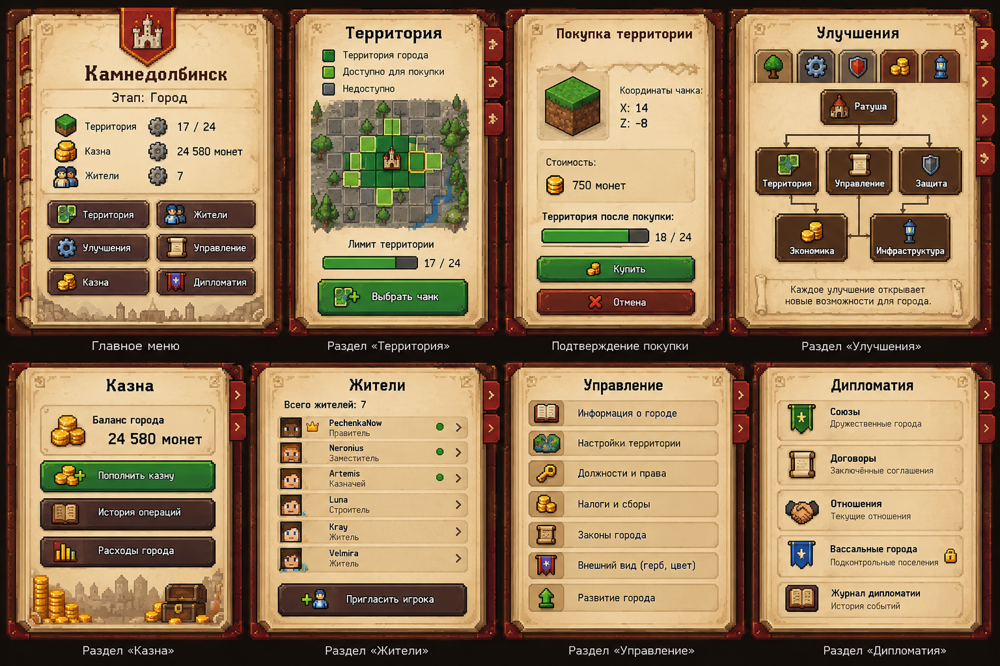

# Градострой / ServerMineCities

Игрок управляет городом через предмет «Книга управления городом». Команды доступны только администрации.
Книга содержит обзор, территорию, улучшения, казну, жителей, управление, дипломатию и рынок.

Новый город получает ровно четыре чанка. В bootstrap расчёт стартовой области реализован как 2×2 от выбранного угла;
это геометрический помощник, а не завершённое продуктовое решение о выборе места основания.
Все четыре участка должны проверяться на доступность и защищённые зоны перед атомарной записью.

Расширение допускается только по общей стороне существующей территории и в том же мире.
Улучшения открывают возможности города, но не добавляют `+N` чанков. Телепортации на площадь нет.

Прототип использовал город Камнедолбинск, 17/24 чанка и казну 24 580. Это данные иллюстрации, а не стартовые значения реального города.
PNG содержат эти значения прямо в изображении; рабочие экраны должны получать динамические подписи из CitiesService.
Рынка в исходных восьми PNG нет: пока предусмотрен ванильный экран-заготовка.
